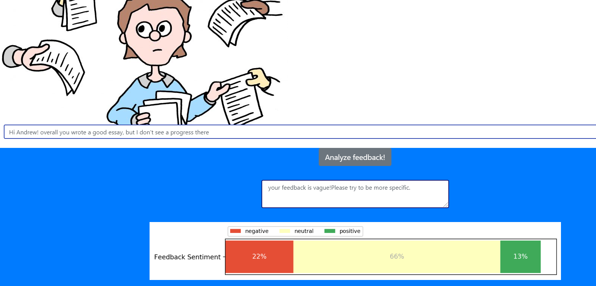
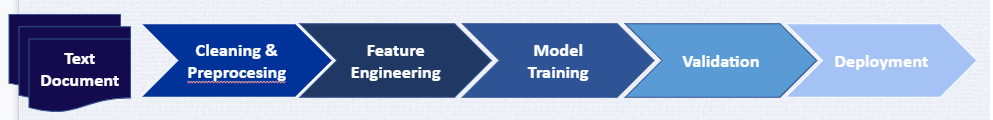
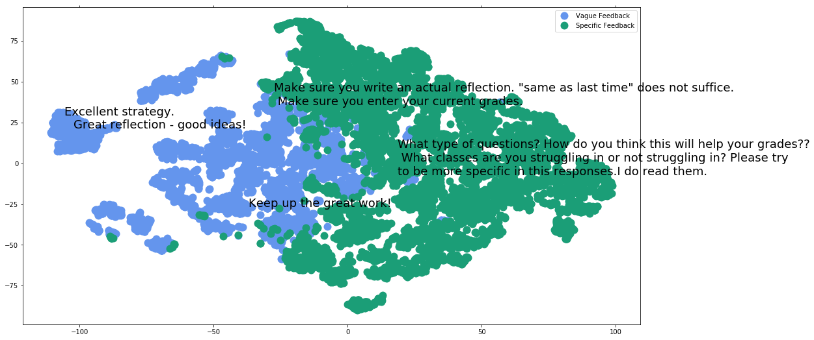
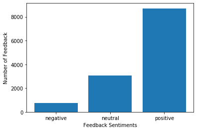

## Feedalyzer:
Make your Feedback Count!

## What is Feedalyzer?
Feedalyzer is a feedback analyzer tool to predict the quality and tone of teachers' feedback on students' reflections. 
I partnered with consulting company Sown-To-Grow (STG) to build a feedback analyzer tool for them. STG has an online platform for students where they can set goals, reflect on their goals, and get feedback from teachers. Feedback coming from teachers Brings awareness to the process of learning and strategies taken by students. Academic feedback is an essential part of effective learning and is consistently related to achievement compared to any other teaching behaviour. Effective feedback gives students guidance on improving their learning experience through self-evaluation and adjustment. It can support student enthusiasm for learning, retention, and even transition to higher education. 
However, providing feedback requires much skill by teachers and can have positive or negative impact on achievement depending on how it is given. Feedback is the best tool but it os only effective it is delivered properly.
This product is an interactive web-app for teachers to analyze the quality and tone of their feedback to help them improve their teaching skills.

## Feedalyzer Web app
Users input their feedback and the app will detect the quality of their feedback(if it is an specific or a vague feedback) and will report on the sentiment score of their feedback (how positive, neautral, or negative their tone is). 
you can check the web app here: http://feedzer.ca/   (this domain is now inactive though.)

## How Feedalyzer works?
In this section,  I will explain how the Feedalyzer has been built. The following simplified chart shows the NLP pipeline that I used to tackle this problem. 

it is hard to figure out what is the definition of 'specific' feedback; after some reserach, I came up with a definition for high-quality (specific) feedback which is a feedback with some points of explanation, reason, or example in it. The specific feedback should be detailed and informative.I did cleaning and pre-processing on feedback data; such as, removing duplicates and blanks, removing punctuations, tokenization, and lemmatization. Then, feature extraction and selection was performed to choose those features that are believed to influence quality of feedback (specific vs. vague) such as: normalized stopword counts of a feedback, average number of word characters in a feedback, Part of speech and Name Entity Recognition (NER) taggings, and doc2vec. Due to the nature of data and the fact that there is no label available for this text data, unsupervised clustering techniques(K-means and Hierarchical) were conducted to group vague feedback against specific feedback using features mentioned above. The plot below shows the final outcome of clustering analysis technique. 1,250 feedback were hold out and manually labelled for validation purposes and were compared against the model predictions. Also in order to predict the tone of feedback, sentiment analysis was performed. 

the result of sentiment analysis on training data is shown below. it can be observed that majority of feedback have positive tone. However, psychologists have shown that negative feedback can equally be effective and sometimes can even lead to better performance and growth. A right balance of both positive and negative feedback is required to motivate students. Skillfull feedback is always going to be a mixture of both. Therefore, there is something in this result for teachers to think about.

You can see the google slides of this project at: https://docs.google.com/presentation/d/1pQTQXp-G-idfz-4FJxIcqm8idZW6kEx-dhi4wrnGCcY/edit
 
 

 
 

##Prerequisites
* Libraries: pandas, numpy, scikit-learn, nltk,Spacy,matplotlib, ...
